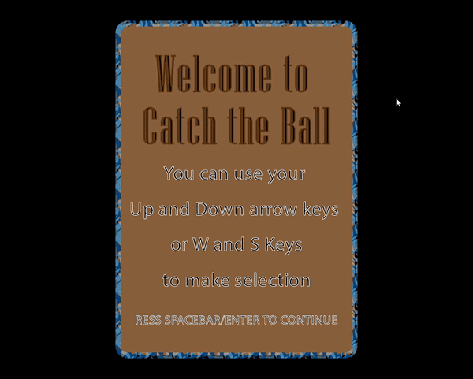

# Catch the Ball

Catch the Ball is a simple game engine created with C++ as a course project for CSCI 39541 Hunter College.

## Built with

* [VS Community](https://visualstudio.microsoft.com/vs/community/)
* [GLFW](https://www.glfw.org/)
* [OpenGL](https://www.opengl.org/)
* [STB](https://github.com/nothings/stb)

## Installation

Use software [CMake](https://cmake.org/) to build and run the project.

## Contributing
Pull requests are welcome. For major changes, please open an issue first to discuss what you would like to change.

Please make sure to update tests as appropriate.

## License
[MIT](https://choosealicense.com/licenses/mit/)
